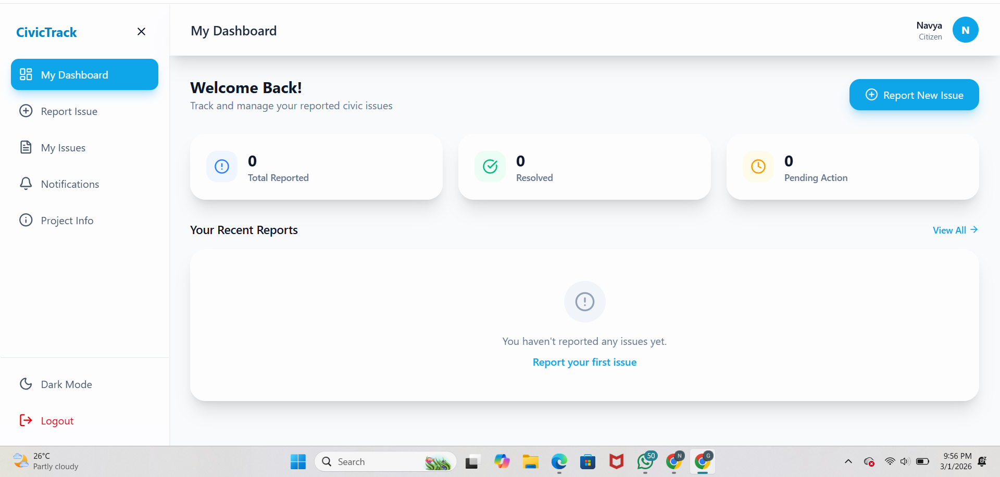
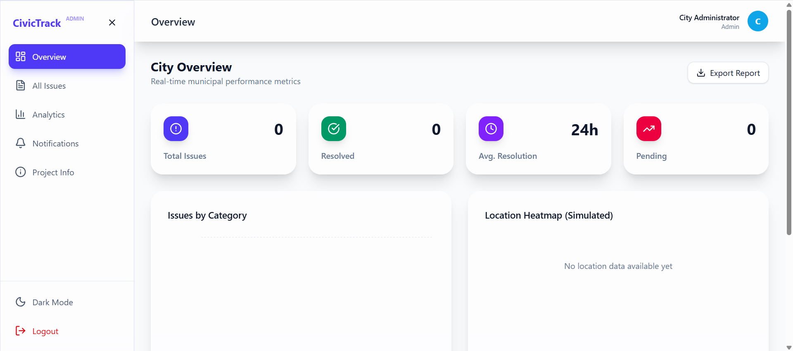
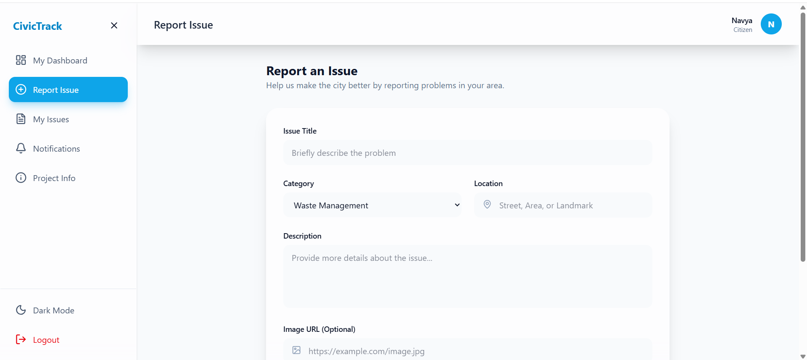

# 🌆 CivicTrack – Smart Citizen Issue Processing System

CivicTrack is a full-stack civic issue management platform designed to bridge the gap between citizens and municipal authorities.

It enables citizens to report public issues and allows government administrators to efficiently manage, track, and resolve them through a powerful analytics dashboard.

---

## 🎯 Problem Statement

Urban areas face delays and inefficiencies in resolving public complaints such as:

- Road damage
- Waste management issues
- Water leakage
- Streetlight failures
- Public sanitation problems

CivicTrack provides a transparent and structured system to streamline issue reporting and resolution.

---

## 🏗️ System Architecture

Frontend: React.js  
Backend: Node.js + Express  
Database: MongoDB  
Authentication: JWT-based Role Authentication  
Architecture Pattern: MVC  

---

## 👥 User Roles

### 👤 Citizen
- Register / Login
- Report civic issues
- Upload issue images
- Track issue status
- View complaint history
- Filter issues by status

### 🏛️ Admin (Municipal Authority)
- Secure admin login
- Dashboard with analytics
- View all reported issues
- Filter by category, status, and location
- Update issue status (Pending → In Progress → Resolved)
- Assign priority
- Add remarks
- View resolution performance metrics

---

## 📊 Admin Dashboard Features

- Total Issues Overview
- Pending / In Progress / Resolved statistics
- Category-based analytics
- Performance tracking
- Interactive data visualization
- Modern responsive UI

---

## 🔐 Role-Based Access Control

The system uses role-based authentication:

- Citizens can only access citizen routes
- Admins can only access admin routes
- JWT verification middleware protects private routes

---

## 🗂️ Project Folder Structure
CivicTrack/
│
├── client/ # React frontend
│ ├── components/
│ ├── pages/
│ ├── routes/
│
├── server/ # Node backend
│ ├── models/
│ ├── controllers/
│ ├── routes/
│ ├── middleware/
│
├── .env.example
├── package.json
└── README.md

## 📸 Application Screenshots

### Login Page

### Citizen Dashboard

### Admin Dashboard

### Issue Submission Page

